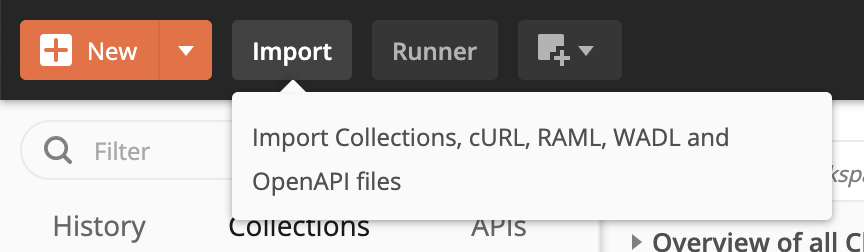
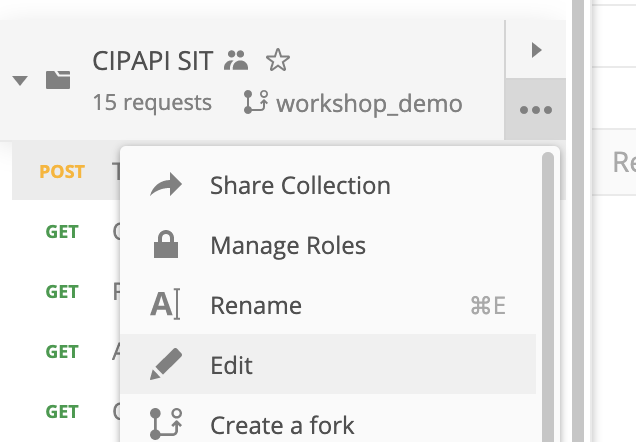
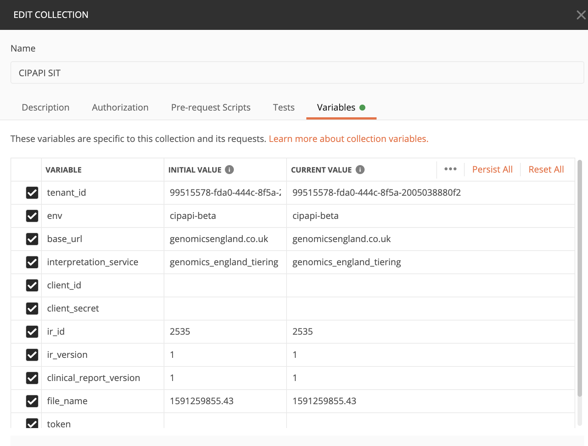
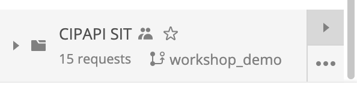
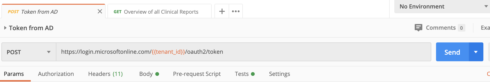

# Instructions for using the CIPAPI-SIT Postman collection

## Import collection

1. Install [Postman](https://www.postman.com/downloads/)
2. Download the collection [JSON](https://github.com/genomicsengland/ACGS_GeL_API_workshop/blob/postman_workshop/postman_workshop/CIPAPI%20SIT.postman_collection.json)
3. Import the JSON into Postman. This should load the CIPAPI-SIT collection.

## Configure collection variables
1. Click the three dots next to the collection name, and select 'Edit'.

2. Select the 'Variables' tab. You will need to add your client id/secret and update the case details to match a case you have access to.

## Running tests
You should now be able to run the tests. You can either:
- Run the whole collection. Click the 'play' icon next to the collection, then click 'Run'

- Run tests individually. Open the test and click 'Send'. (Note: You must run the 'Token from AD' test to set/update the token, before running other tests)

## NOTE
Some of these tests will create data in CIPAPI and should therefore only be run against the SIT CIPAPI.